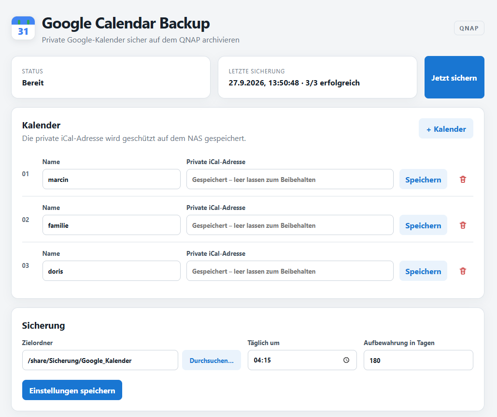

# Google Calendar Backup for QNAP

**Google Kalender Backup für QNAP / Google Calendar Backup for QNAP** – sichert private Google-Kalender automatisch als `.ics`-Dateien auf einem QNAP NAS. Geeignet für alle, die ein **Google Kalender Backup auf einem QNAP NAS** bzw. ein **Google Calendar Backup auf QNAP** suchen.

Die App läuft als QPKG auf **QTS / x86_64**, insbesondere auf dem **TS-673A**. Sie benötigt weder Google Workspace noch ein Google-Passwort oder OAuth.

**Suchbegriffe / Keywords:** Google Kalender Backup, Google Kalender sichern, Google Calendar Backup, Google Calendar sichern, Kalender Backup QNAP, Calendar Backup QNAP, QNAP Google Kalender, QNAP Google Calendar, ICS Backup, QTS Backup.

> **Aktuelle Version: 1.0.0 Stable**, auf Basis der erfolgreich auf dem QNAP getesteten 0.1.16. Installation und Bedienung erfolgen über QTS. Die Weboberfläche wird ausschließlich über den angemeldeten QTS-Zugang und dessen internen Proxy bereitgestellt; der Node-Dienst lauscht nur auf `127.0.0.1:19884`.



Der Screenshot zeigt die Oberfläche vom 27. September 2026 vor der Datumsformatierung aus 0.1.15; gespeicherte Kalenderadressen sind ausgeblendet.

## Features

- Mehrere Google-Kalender mit unabhängigem Speichern jeder Kalenderzeile.
- Zeitgestempelte ICS-Dateien, täglicher Zeitplan und einstellbare Aufbewahrung.
- Manuelle Sicherung mit Status und Ergebnis des letzten Laufs.
- Auswahl vorhandener QNAP-Freigaben und Unterordner.
- Prüfung auf iCalendar-Inhalt und Übernahme erst nach abgeschlossenem Download.
- Sicherungsverlauf in `backup.log` und Meldungen an QNAP QuLog Center.
- Bedienung über den QTS-Zugang; kein separates App-Passwort.

## Voraussetzungen und Grenzen

- QTS **ab 5.1.0**, QNAP mit **x86_64**-Prozessor. ARM und QuTS hero sind nicht als unterstützt verifiziert.
- Ein Google-Kalender mit geheimer iCal-Adresse, Internetzugang des NAS und eine geeignete QNAP-Freigabe.
- Der Zeitplan verwendet die lokale Uhrzeit des NAS. Die App muss zur geplanten Uhrzeit laufen; verpasste Läufe werden nicht nachgeholt.
- ICS-Snapshots sichern die von Google bereitgestellten Kalenderdaten. Kontoeinstellungen und Freigaberechte werden nicht gesichert; eine automatische Wiederherstellung bietet die App nicht.

## Installation

1. Das aktuelle [x86_64-QPKG aus den GitHub Releases](https://github.com/kulmi84/Google-Calendar-Backup-for-QNAP/releases) herunterladen. Für Version 1.0.0: [GoogleCalendarBackup_1.0.0_x86_64.qpkg](https://github.com/kulmi84/Google-Calendar-Backup-for-QNAP/releases/download/v1.0.0/GoogleCalendarBackup_1.0.0_x86_64.qpkg). Die zugehörige `.qpkg.sha256`-Datei enthält die Prüfsumme.
2. In QTS mit einem Konto mit Berechtigung zur App-Installation anmelden.
3. **App Center → Manuell installieren** öffnen, die heruntergeladene `.qpkg`-Datei auswählen und die Installation bestätigen. Die automatisch von GitHub angebotenen Quellcode-ZIP-/TAR-Dateien sind keine QNAP-Installer.
4. Falls QTS die Installation wegen einer fehlenden digitalen Signatur blockiert: die App-Center-Einstellung zur Installation von Anwendungen ohne gültige digitale Signatur prüfen und nur für das bewusst heruntergeladene Paket erlauben. Die genaue Bezeichnung hängt von der QTS-Version ab. Der aktuelle Build enthält keinen Signierungsschritt.
5. Die App über das QTS-Desktop-Symbol starten. Es ist weder eine Portfreigabe am Router noch eine zusätzliche öffentliche Weboberfläche nötig.
6. Kalender und Zielordner einrichten, **Jetzt sichern** wählen und Ergebnis sowie die erzeugten ICS-Dateien im Zielordner prüfen.

Bei einem Upgrade bleibt die Konfiguration unter `/etc/config/GoogleCalendarBackup` erhalten. Vorhandene Sicherungen werden durch die Deinstallation nicht gelöscht. Falls noch ein früherer Cronjob für `google_calendar_backup.sh` aktiv ist, ihn **nach einer erfolgreichen Sicherung mit dem QPKG** entfernen, damit nicht zwei Jobs parallel sichern.

## Einrichtung und Bedienung

1. In Google Kalender am Desktop den gewünschten Kalender unter **Einstellungen → Einstellungen für meine Kalender → Kalender integrieren** öffnen und die **geheime Adresse im iCal-Format** kopieren.
2. In der App **+ Kalender** anklicken, einen Namen und die private iCal-Adresse eintragen und direkt in dieser Zeile **Speichern** wählen. Weitere Kalender genauso hinzufügen. Ungespeicherte andere Zeilen hindern das einzelne Speichern nicht.
3. Einen vorhandenen Kalender ändern: Den Namen anpassen oder eine neue private iCal-Adresse eingeben und in seiner Zeile **Speichern** anklicken. Bei unveränderter Adresse das Feld leer lassen; die gespeicherte Adresse bleibt erhalten und wird aus Sicherheitsgründen nicht an den Browser zurückgegeben.
4. Unter **Sicherung** eine QNAP-Freigabe und einen Unterordner über **Durchsuchen…** als Ziel wählen, die tägliche Uhrzeit und Aufbewahrungsdauer einstellen und **Einstellungen speichern** anklicken.
5. Mit **Jetzt sichern** einen Lauf auslösen. Oben erscheinen Status, Zeitpunkt und Ergebnis der letzten Sicherung.

Der Papierkorb entfernt eine Kalenderzeile zunächst aus der Oberfläche. **Erst „Einstellungen speichern“ übernimmt die Löschung dauerhaft.** Diese Schaltfläche speichert die gesamte Kalenderliste und die Sicherungseinstellungen; unvollständige Kalenderzeilen können dabei zu einer Validierungsfehlermeldung führen. Kalendernamen müssen eindeutig sein.

Behandle die geheime iCal-Adresse wie ein Passwort: Wer sie besitzt, kann den Kalender lesen.

## Sicherungsdateien

Jeder Lauf erstellt pro Kalender eine eigene Datei mit Zeitstempel, zum Beispiel:

```text
marcin_2026-09-27_04-15-00.ics
familie_2026-09-27_04-15-00.ics
doris_2026-09-27_04-15-00.ics
```

Die App prüft, ob die Antwort eine iCalendar-Datei enthält, und übernimmt sie erst danach als `.ics`. Ältere passende Dateien werden gemäß der eingestellten Aufbewahrungsdauer entfernt. Im Zielordner liegt auch `backup.log`; Erfolg und Fehler werden zusätzlich an QNAP QuLog Center gemeldet. Die Dateien können später wieder in einen Kalender importiert werden.

## Sicherheit und Berechtigungen

- Keine zusätzlichen extern erreichbaren Ports und keine Router-Portfreigabe: Der Backend-Dienst bindet ausschließlich an `127.0.0.1:19884` und wird über den QTS-Proxy geöffnet.
- Gespeicherte private Kalenderadressen liegen in der Konfigurationsdatei mit Dateimodus `0600`; die Oberfläche gibt sie nicht im Klartext zurück.
- Die Ordnerauswahl zeigt konfigurierte, sichtbare QNAP-Freigaben und deren Unterordner. Zugriffe außerhalb solcher Freigaben werden abgewiesen.
- **Einschränkung:** Der QPKG-Dienst erhält derzeit nicht die Identität des angemeldeten QTS-Benutzers. Die Ordnerauswahl kann daher dessen individuelle Freigaberechte nicht filtern. Beschränke den App-Zugriff in QTS entsprechend und schütze den Sicherungsordner mit QNAP-Freigaberechten. `.ics`-Sicherungen enthalten private Kalenderdaten.

## Fehlerdiagnose

Den Installationspfad und die Paketversion auf dem NAS auslesen:

```sh
P=$(/sbin/getcfg GoogleCalendarBackup Install_Path -f /etc/config/qpkg.conf)
/sbin/getcfg GoogleCalendarBackup Version -f /etc/config/qpkg.conf
tail -n 80 "$P/log/service.log"
```

`service.log` enthält Startfehler und Backend-Meldungen. Der Sicherungsverlauf steht im gewählten Zielordner unter `backup.log`. Bitte **keine privaten iCal-Adressen** aus Konfiguration oder Logs öffentlich in GitHub-Issues posten.

## Entwicklung und QDK-Build

Für die lokale Entwicklung wird Node.js 20 oder neuer benötigt:

```sh
npm test
npm start
```

Lokal lauscht die App auf `127.0.0.1:19884`; im Entwicklungsmodus sind Zielordner außerhalb von `/share` möglich. Im QPKG-Modus ist eine konfigurierte QNAP-Freigabe unter `/share` erforderlich.

Der vorhandene [GitHub-Actions-Workflow](.github/workflows/build-qpkg.yml) testet die Anwendung, lädt den prüfsummenverifizierten Node.js-22-x86_64-Build für `glibc-217`, bereitet das QDK-Projekt vor, baut das QPKG mit QDK 2.5.3 und prüft das Paket. Bei einer neuen Versionsnummer auf `main` werden QPKG, SHA-256-Datei und versionsbezogene Hinweise als **Release-Entwurf** vorbereitet; die öffentliche Freigabe erfolgt anschließend bewusst. Die manuelle Vorbereitung ist ebenfalls möglich:

```sh
NODE_BIN=/pfad/zu/linux-x64/bin/node ./scripts/prepare-qdk-project.sh
```

Der gewählte Node-Build muss zur glibc-Version des QNAP passen. Die Paketvorbereitung benötigt auch den vollständigen Lizenztext dieses Node-Builds; er wird als `app/NODEJS-LICENSE` beigelegt. Seit 0.1.16 enthält das QPKG diese Beigabe; sie bleibt in 1.0.0 erhalten. Details: [Drittanbieterhinweise](THIRD_PARTY_NOTICES.md).

## Veröffentlichungsstand

**1.0.0 Stable ist zur öffentlichen Veröffentlichung freigegeben.** Grundlage ist die vom Nutzer erfolgreich auf dem QNAP getestete 0.1.16. Gegenüber 0.1.16 bleiben Anwendungslogik und Laufzeit unverändert; Versionsmetadaten, Dokumentation und Stable-Release-Status werden angepasst. [Release-Hinweise für 1.0.0](docs/releases/1.0.0.md) und [Changelog](CHANGELOG.md) beschreiben die Änderungen. Die [Release-Vorbereitung](docs/RELEASING.md) beschreibt Paketprüfung und Freigabe. GitHub ist der Veröffentlichungsweg; die Installation erfolgt manuell über das QNAP App Center.

Fehler können über [GitHub Issues](https://github.com/kulmi84/Google-Calendar-Backup-for-QNAP/issues) gemeldet werden. Bitte Paketversion, NAS-Modell, QTS-Version und bereinigte Fehlermeldung angeben. Sicherheitsprobleme bitte gemäß [SECURITY.md](SECURITY.md) melden.

## Lizenz

Die Anwendung steht unter der [MIT-Lizenz](LICENSE), Copyright © 2026 Marcin Kulamczewski. Beigepackte Drittanbieterkomponenten behalten ihre eigenen Lizenzbedingungen. Dies ist ein unabhängiges Community-Projekt und keine offizielle Anwendung von QNAP oder Google.
